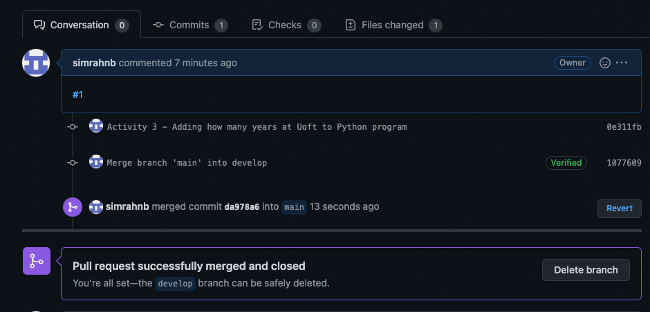
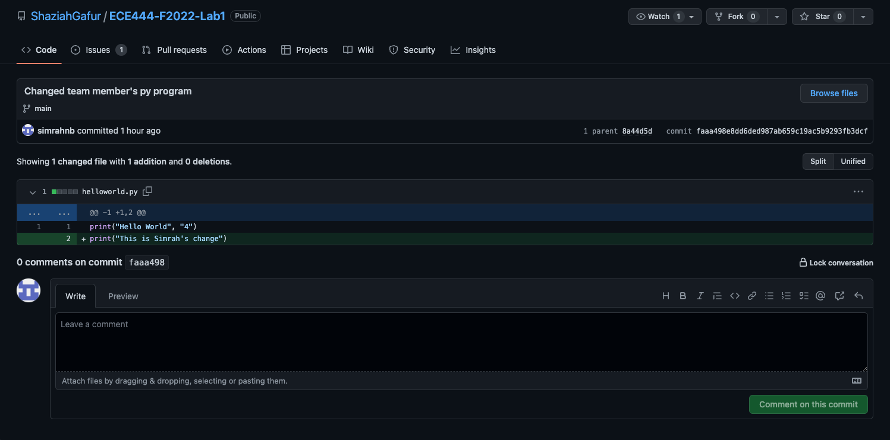
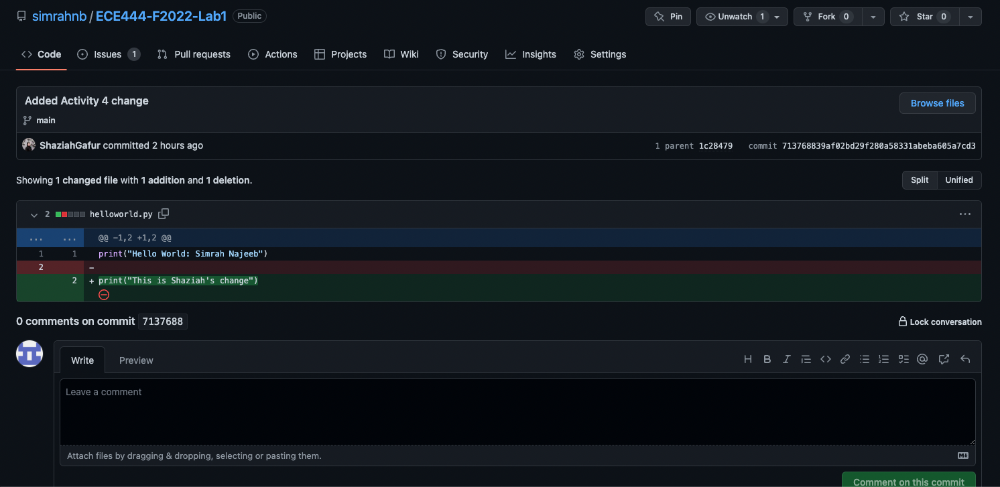
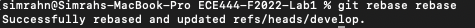
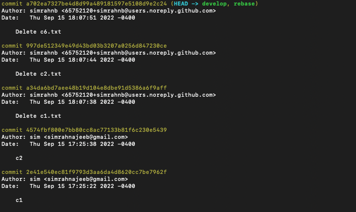
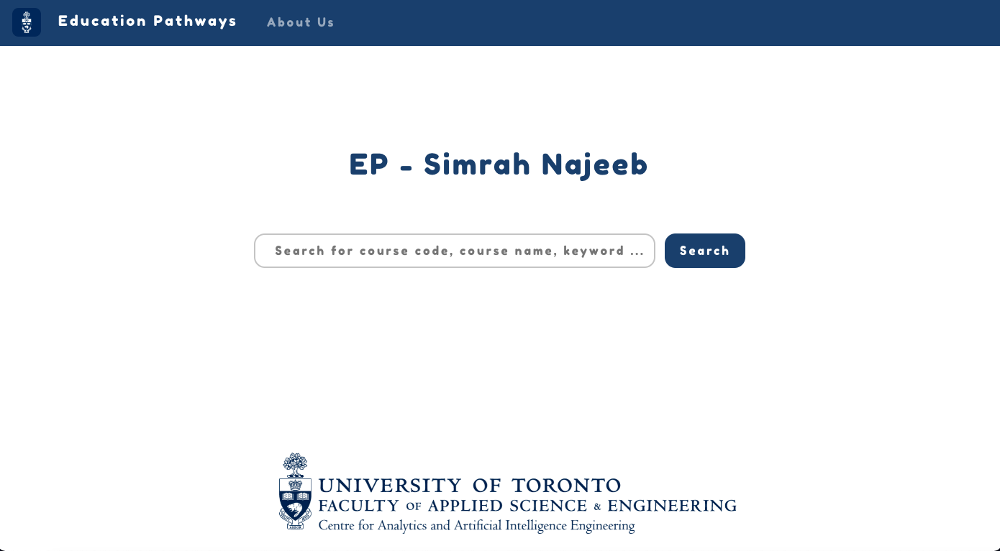
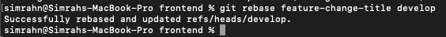
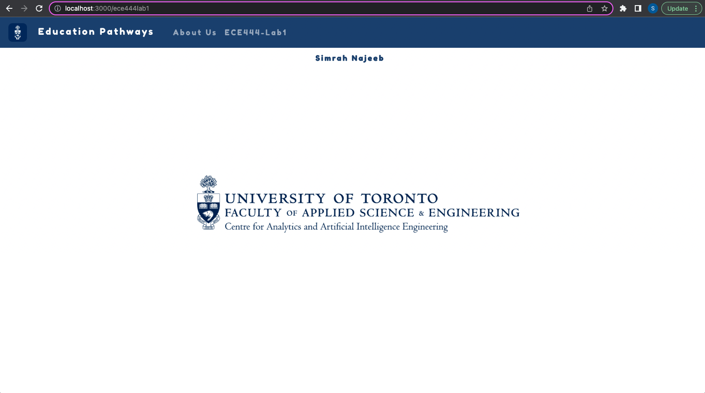
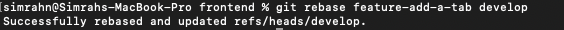

Simrah Najeeb

#### Activity 1 

#### Activity 2 

#### Activity 3 

#### Activity 4 
[Teammate's GitHub repository](https://github.com/ShaziahGafur/ECE444-F2022-Lab1) 

My change on teammate's repo: 
 
Teammate's change on my repo: 

#### Activity 5 

#### Activity 6 
[Link to my EP repo](https://github.com/simrahnb/ECE444-F2022-EP)

#### Activity 7 
 

### Activity 8 
 

